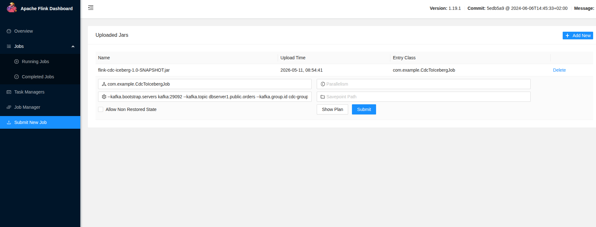

# Flink CDC → Iceberg (Hive Metastore + MinIO)

Streaming pipeline: **Debezium → Kafka → Flink → Iceberg (Hive Catalog, MinIO storage)**

```
Postgres ──[WAL]──► Debezium Connect ──► Kafka
                                            │
                               Flink Job ◄──┘
                   (DebeziumAvroToRowDataDeserializer)
                                 │
                     FlatMapRowData (RowKind)
                                 │
                     FlinkSink → Iceberg table
                         (equality-delete upsert)
                                 │
                    Hive Metastore (catalog)
                    MinIO / S3A (data files)
```

## Version Matrix

| Component | Version   |
|-----------|-----------|
| Apache Flink | 1.19.1    |
| Apache Iceberg | 1.8.0     |
| Apache Hadoop | 3.3.4     |
| Apache Hive (HMS) | 3.1.3     |
| Apache Kafka | 3.5.1     |
| flink-connector-kafka | 3.2.0-1.19 |
| Java | 17        |

---

## Project Layout

```
flink-cdc-iceberg/
├── debezium-connector.json                                 # json to register debezium connector
├── docker-compose.yml
├── download-jars.sh                                        # script to download required jars to build flink cluster
├── flink                                                   # resource for flink docker
├── hms                                                     # resource for hms docker
├── trino                                                   # resource for trino docker
├── pom.xml
├── README.md
├── sql                                                     # init sql for postgresql
└── src/main/java/com/example/
    ├── CdcToIcebergJob.java                                # main entry point
    ├── config                                              # all CLI/system-property config
    │   └── AppConfig.java
    ├── deserialization
    │   └── DebeziumAvroToRowDataDeserializer.java          # deserializer for kafka message
    ├── schema
    │   ├── DebeziumAvroToIcebergSchemaConverter.java       # convert avro schema to iceberg schema
    │   └── SchemaUtilsV2.java
    ├── sink
    │   └── IcebergSinkFactoryV2.java                       # attach FlinkSink to sink to iceberg table
    └── transform
        └── FlatMapRowData.java
```

---

## Quick Start (local)

### 1. Start the infrastructure

```bash
./download-jars.sh && docker-compose up -d
```

### 2. Register the Debezium connector

```bash
curl -X POST http://localhost:8083/connectors \
     -H "Content-Type: application/json" \
     -d @debezium-connector.json
```

Verify it is running:
```bash
curl http://localhost:8083/connectors/postgres-orders-connector/status | jq .
```

### 3. Build the fat jar

```bash
mvn clean package -DskipTests
```

Output: `target/flink-cdc-iceberg-1.0-SNAPSHOT.jar`

### 4. Submit to the Flink cluster



```bash
--kafka.bootstrap.servers kafka:29092
--kafka.topic dbserver1.public.orders
--kafka.group.id cdc-group-1
--hive.metastore.uri thrift://hive-metastore:9083
--iceberg.warehouse s3a://iceberg/
--iceberg.database default
--iceberg.table orders
--minio.endpoint http://minio:9000
--minio.access.key root
--minio.secret.key root123456
--checkpoint.interval.ms 30000
```

---

## Configuration Reference

All parameters have defaults. Override via `--key value` on the Flink CLI.

| Parameter | Default                       | Description                 |
|-----------|-------------------------------|-----------------------------|
| `kafka.bootstrap.servers` | `kafka:29092`                 | Kafka brokers               |
| `kafka.topic` | `dbserver1.inventory.orders`  | Debezium output topic       |
| `kafka.group.id` | `flink-cdc-iceberg`           | Consumer group              |
| `schema.registry.url` | `http://schema-registry:8081` | URL for the schema registry |
| `hive.metastore.uri` | `thrift://localhost:9083`     | HMS thrift URI              |
| `iceberg.warehouse` | `s3a://iceberg/`              | Iceberg warehouse root      |
| `iceberg.database` | `default`                     | Target Iceberg database     |
| `iceberg.table` | `orders`                      | Target Iceberg table        |
| `minio.endpoint` | `http://minio:9000`           | MinIO S3 API endpoint       |
| `minio.access.key` | `root`                  | MinIO access key            |
| `minio.secret.key` | `root123456`                  | MinIO secret key            |
| `checkpoint.interval.ms` | `30000`                       | Flink checkpoint interval   |
| `job.name` | `Debezium-CDC-to-Iceberg`     | Flink job display name      |

---

## Customizing Partitioning

In `IcebergSinkFactoryV2.ensureTableExists`, change `PartitionSpec.unpartitioned()` to:

```java
// Partition by day of created_at
PartitionSpec.builderFor(schema)
    .day("created_at")
    .build();
```
